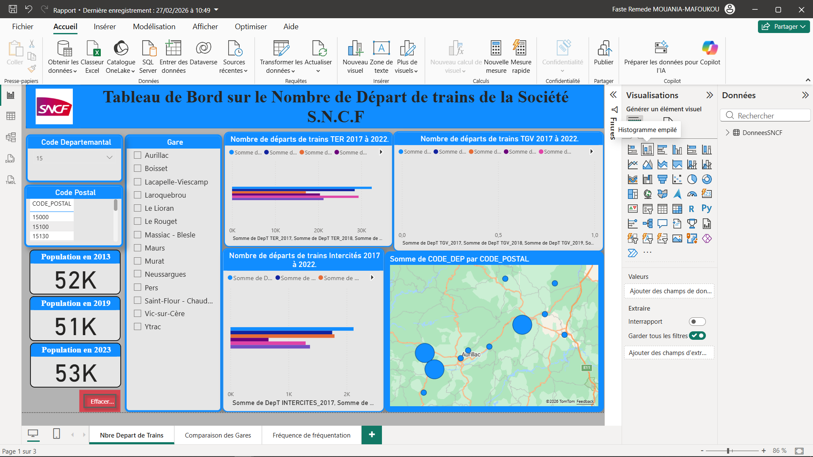
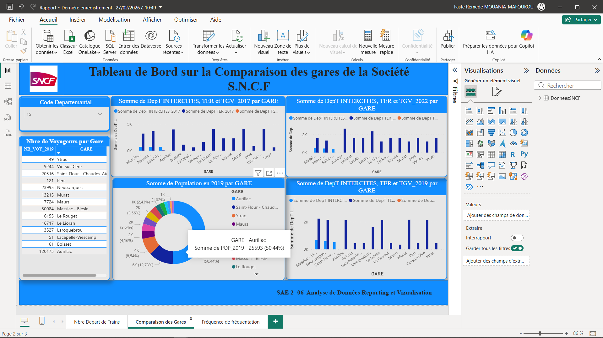
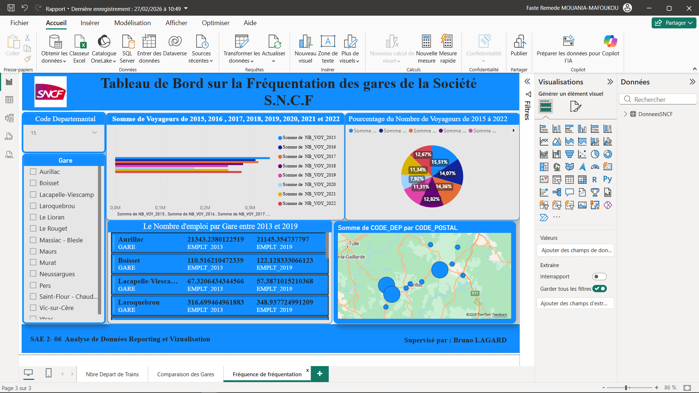

# Projet Dataviz – Analyse de données SNCF  
BUT Sciences des Données – SAE 2.06  
IUT Aurillac  

---

## Contexte du projet

Ce projet s’inscrit dans le cadre de la SAE 2.06 – *Analyse de données, reporting et datavisualisation* du BUT Sciences des Données.

L’objectif est de construire une **datavisualisation pertinente à partir d’un jeu de données fourni par la SNCF**, en formulant une problématique claire et en proposant une représentation graphique adaptée.

Le projet comprend :
- Une phase d’exploration des données
- Le choix d’une problématique
- La construction d’indicateurs
- La réalisation d’un reporting (Power BI)
- Une restitution sous forme de présentation

---

## 📁 Jeu de données

Le jeu de données concerne la **fréquentation annuelle des gares françaises** (montées et descentes) entre **2015 et 2022** :contentReference[oaicite:1]{index=1}.

Les données sont organisées par gare et enrichies avec :

### Données transport
- Nombre de voyageurs (2015–2022)
- Nombre de départs de trains (TER, Transilien, TGV, Intercités) (2017–2022)

### Données territoriales
- Population (2013, 2019, 2023)
- Revenus et niveau de vie (2020)
- Logements (2019)
- Emploi (2017–2022)
- Données immobilières : nombre de ventes et prix médian au m² (2017–2022)

Chaque gare est rattachée à sa commune, certaines grandes villes disposant de plusieurs gares.

---

## Problématique

À partir des données SNCF, l’objectif est de répondre à une question analytique pertinente.

Exemples de questionnements possibles :
- Comment évolue la fréquentation des gares entre 2015 et 2022 ?
- Existe-t-il un lien entre dynamisme immobilier et fréquentation ?
- Les grandes métropoles concentrent-elles l’essentiel du trafic ?
- L’offre de trains influence-t-elle le nombre de voyageurs ?

---

## 📈 Méthodologie

1. Exploration et compréhension du jeu de données  
2. Nettoyage et préparation des données  
3. Construction d’indicateurs (KPI)  
4. Choix des représentations graphiques adaptées  
5. Création d’un tableau de bord interactif sous Power BI  

Le projet peut être abordé selon différents points de vue :
- Journaliste
- Élu local
- Association d’usagers
- SNCF (vision stratégique)

---

## 🛠 Outils utilisés

- Power BI
- Excel
- Python (analyse exploratoire éventuelle)

---

## 📊 Résultat attendu

- Un rapport PDF ou PowerPoint présentant :
  - Le contexte
  - La problématique
  - Les choix méthodologiques
  - Les difficultés rencontrées
- Une datavisualisation claire et pertinente
- Un tableau de bord interactif

---

## 👤 Auteur

Nom : MOUANIA-MAFOUKOU Faste Remède 
Formation : BUT(BAC+3) Sciences des Données 
Parcours : Visualisation Conception des Outils Décisionels 
Année : 2024–2025  

---

## 🚀 Objectif pédagogique

Ce projet vise à développer :
- L’analyse critique de données
- La capacité à formuler une problématique
- La construction d’indicateurs pertinents
- La communication visuelle efficace
- La mise en œuvre d’un outil de Business Intelligence

---
## 📊 Aperçu du Dashboard
#### Vue générale :

  

---

## 📈 Comparaison de Gares

  

---
## 🏙 Fréquence de Fréquentation

  

